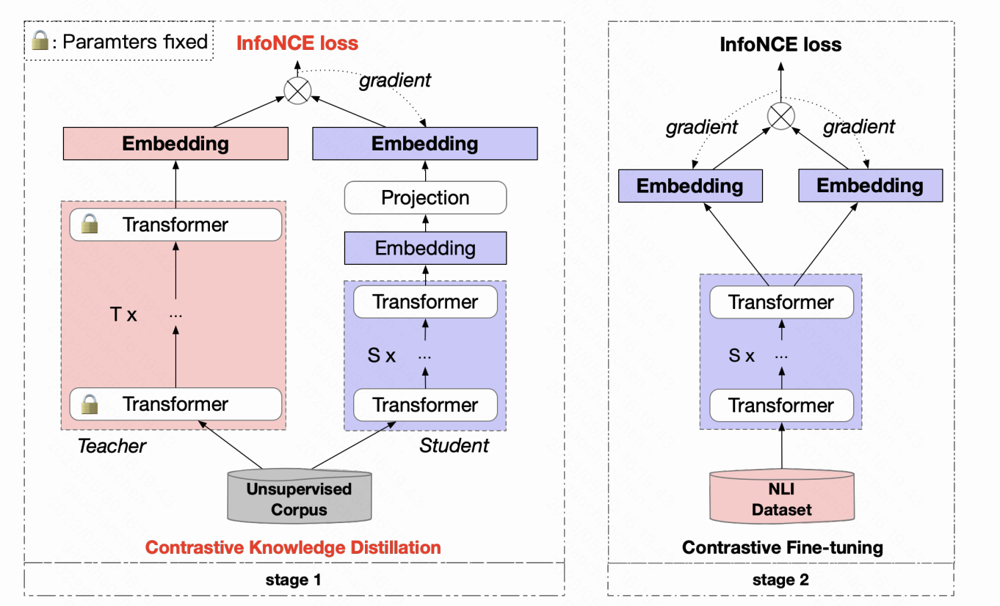

## DistilCSE: Effective Knowledge Distillation For Contrastive Sentence Embeddings

This repository contains the code and pre-trained models for our paper [DistilCSE: Effective Knowledge Distillation For Contrastive Sentence Embeddings](https://arxiv.org/abs/2112.05638).


## Quick Links

  - [Overview](#overview)
  - [Model List](#model-list)
  - [Use DistilCSE](#use-distilcse)
  - [Train DistilCSE](#train-distilcse)
    - [Requirements](#requirements)
    - [Evaluation](#evaluation)
    - [Training](#training)
  - [Bugs or Questions?](#bugs-or-questions)

## Overview

Large-scale contrastive learning models can learn very informative sentence embeddings, but are hard to serve online due to the huge model size. Therefore, they often play the role of "teacher", transferring abilities to small "student" models through knowledge distillation. However, knowledge distillation inevitably brings some drop in embedding effect. To tackle that, we propose an effective knowledge distillation framework for contrastive sentence embeddings, termed DistilCSE. It first applies knowledge distillation on a large amount of unlabeled data, and then fine-tunes student models through contrastive learning on limited labeled data. To achieve better distillation results, we further propose Contrastive Knowledge Distillation (CKD). CKD uses InfoNCE as the loss function in knowledge distillation, enhancing the objective consistency among teacher model training, knowledge distillation, and student model fine-tuning. Extensive experiments show that student models trained with the proposed DistilCSE and CKD suffer from little or even no performance decrease and consistently outperform the corresponding counterparts of the same parameter size. Impressively, our 110M student model outperforms the latest state-of-the-art model, i.e., Sentence-T5 (11B), with only 1% parameters and 0.25% unlabeled data.



## Model List

Our released models are listed as following. 
|              Model              | Avg. STS |
|:-------------------------------|:--------:|
|  [CKD-BERT-base](https://huggingface.co/ffgcc/DistilCSE/blob/main/CKD-BERT-base.pth) |   85.04  |
| [CKD-Tiny-L6](https://huggingface.co/ffgcc/DistilCSE/blob/main/CKD-Tiny-L6.pth) |    84.58   |
|    [CKD-Tiny-L4](https://huggingface.co/ffgcc/DistilCSE/blob/main/CKD-Tiny-L4.pth)    |    82.84   |

## Use DistilCSE

1. Download the related checkpoint.

2. The structure of CKD-BERT-base is consistent with that of BERT-base, the structure of CKD-Tiny-L6 is consistent with that of General_TinyBERT_v2(6layer-768dim), the structure of CKD-Tiny-L4 is consistent with that of General_TinyBERT_v2(4layer-312dim). General_TinyBERT_v2(6layer-768dim) and General_TinyBERT_v2(4layer-312dim) are from [TinyBERT](https://github.com/huawei-noah/Pretrained-Language-Model/tree/master/TinyBERT). The model structure can be initialized from related models and load our model parameters.

```python
import torch
from scipy.spatial.distance import cosine
from transformers import AutoModel, AutoTokenizer

# Import our models. The package will take care of downloading the models automatically
tokenizer = AutoTokenizer.from_pretrained("bert-base-uncased")
model = AutoModel.from_pretrained("bert-base-uncased")

model.load_state_dict(torch.load('CKD-BERT-base.pth',map_location='cpu'),strict=False)

# Tokenize input texts
texts = [
    "There's a kid on a skateboard.",
    "A kid is skateboarding.",
    "A kid is inside the house."
]

inputs = tokenizer(texts, padding=True, truncation=True, return_tensors="pt")

# Get the embeddings
with torch.no_grad():
    embeddings = model(**inputs, output_hidden_states=True, return_dict=True).pooler_output

# Calculate cosine similarities
# Cosine similarities are in [-1, 1]. Higher means more similar
cosine_sim_0_1 = 1 - cosine(embeddings[0], embeddings[1])
cosine_sim_0_2 = 1 - cosine(embeddings[0], embeddings[2])

print("Cosine similarity between \"%s\" and \"%s\" is: %.3f" % (texts[0], texts[1], cosine_sim_0_1))
print("Cosine similarity between \"%s\" and \"%s\" is: %.3f" % (texts[0], texts[2], cosine_sim_0_2))
```

If you encounter any problem when directly loading the models by HuggingFace's API, you can also download the models manually from the above table and use `model = AutoModel.from_pretrained({PATH TO THE DOWNLOAD MODEL})`.

## Train DistilCSE

In the following section, we describe how to train a DistilCSE model by using our code.

### Requirements

Then run the following script to install the remaining dependencies,

```bash
pip install -r requirements.txt
```

### Evaluation
Our evaluation code for sentence embeddings is based on a modified version of [SentEval](https://github.com/facebookresearch/SentEval). It evaluates sentence embeddings on semantic textual similarity (STS) tasks and downstream transfer tasks. For STS tasks, our evaluation takes the "all" setting, and report Spearman's correlation. 

Before evaluation, please download the evaluation datasets by running
```bash
cd SentEval/data/downstream/
bash download_dataset.sh
```


```bash
python -u my_finetune_nli/eval/evaluation.py \
    --model_name_or_path CKD-BERT-base.pth \
    --pooler cls \
    --task_set sts \
    --mode test \
```
which is expected to output the results in a tabular format:
```
------ test ------
+-------+-------+-------+-------+-------+--------------+-----------------+-------+
| STS12 | STS13 | STS14 | STS15 | STS16 | STSBenchmark | SICKRelatedness |  Avg. |
+-------+-------+-------+-------+-------+--------------+-----------------+-------+
| 79.51 | 88.85 | 84.1 | 88.47 | 85.06 |    87.97     |      81.34      | 85.04 |
+-------+-------+-------+-------+-------+--------------+-----------------+-------+
```

Arguments for the evaluation script are as follows,

* `--model_name_or_path`: Need to specify the location of the pth file.
* `--pooler`: Pooling method. Now we support
    * `cls` (default): Use the representation of `[CLS]` token. A linear+activation layer is applied after the representation (it's in the standard BERT implementation). 
    * `cls_before_pooler`: Use the representation of `[CLS]` token without the extra linear+activation. 
    * `avg`: Average embeddings of the last layer. If you use checkpoints of SBERT/SRoBERTa ([paper](https://arxiv.org/abs/1908.10084)), you should use this option.
    * `avg_top2`: Average embeddings of the last two layers.
    * `avg_first_last`: Average embeddings of the first and last layers. If you use vanilla BERT or RoBERTa, this works the best.
* `--mode`: Evaluation mode
    * `test` (default): The default test mode. To faithfully reproduce our results, you should use this option.
    * `dev`: Report the development set results. Note that in STS tasks, only `STS-B` and `SICK-R` have development sets, so we only report their numbers. It also takes a fast mode for transfer tasks, so the running time is much shorter than the `test` mode (though numbers are slightly lower).
    * `fasttest`: It is the same as `test`, but with a fast mode so the running time is much shorter, but the reported numbers may be lower (only for transfer tasks).
* `--task_set`: What set of tasks to evaluate on (if set, it will override `--tasks`)
    * `sts` (default): Evaluate on STS tasks, including `STS 12~16`, `STS-B` and `SICK-R`. This is the most commonly-used set of tasks to evaluate the quality of sentence embeddings.
    * `transfer`: Evaluate on transfer tasks.
    * `full`: Evaluate on both STS and transfer tasks.
    * `na`: Manually set tasks by `--tasks`.
* `--tasks`: Specify which dataset(s) to evaluate on. Will be overridden if `--task_set` is not `na`. See the code for a full list of tasks.

### Training

**Data**

We construct an unlabeled dataset with 5M high-quality english sentences from opensource news, termed News-5m, for the knowledge distillation stage of the proposed DistilCSE framework.
Download the dataset from [News-5m](https://huggingface.co/datasets/ffgcc/NEWS5M)

**Training scripts**

We provide example training scripts for DistilCSE. In `ckd_contrastive_run.sh`.
We explain the arguments in following:
* `--data_path`: Training file path. 
* `--start_model`: Pre-trained checkpoints to start with.
* `--temp`: Temperature for the contrastive loss.
* `--pooler_type`: Pooling method. It's the same as the `--pooler_type` in the [evaluation part](#evaluation).

For results in the paper, we use 8*V100 with CUDA 11. Using different types of devices or different versions of CUDA/other softwares may lead to slightly different performance.


## Bugs or questions?

If you have any questions related to the code or the paper, feel free to email Chaochen (`gaochaochen@iie.ac.cn`) and Wuxing (`wuxing@iie.ac.cn`). If you encounter any problems when using the code, or want to report a bug, you can open an issue. Please try to specify the problem with details so we can help you better and quicker!